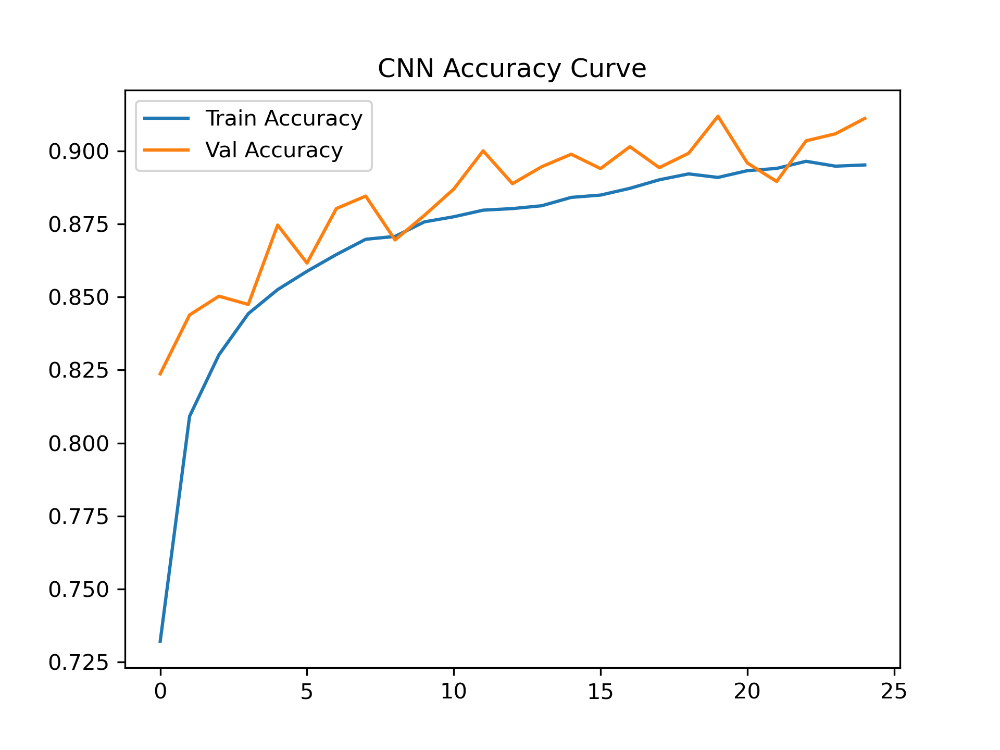
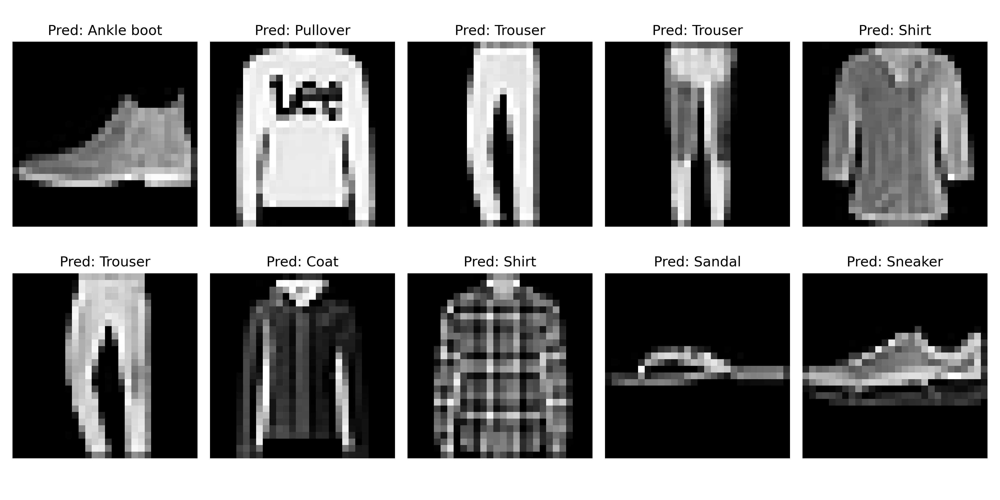

Fashion MNIST Classification – ANN & CNN

This project demonstrates image classification on the Fashion MNIST dataset using both Artificial Neural Networks (ANN) and Convolutional Neural Networks (CNN).
The goal is to compare the performance of ANN vs CNN and visualize model evaluation with accuracy/loss curves, confusion matrices, and sample predictions.

The dataset is automatically downloaded and loaded using Keras.

🗂 Project Structure
Fashion-MNIST-Classification/
│
├── notebooks/
│   ├── 01_data_preprocessing.ipynb
│   ├── 02_ann_model.ipynb
│   ├── 03_cnn_model.ipynb
│   └── 04_model_evaluation.ipynb
│
├── images/
│   ├── cnn_accuracy_curve.png
│   ├── cnn_loss_curve.png
│   ├── ann_accuracy_curve.png
│   ├── ann_loss_curve.png
│   ├── cnn_confusion_matrix.png
│   ├── cnn_sample_predictions.png
│   └── cnn_sample_data.png
│
├── best_model.h5
├── README.md
└── requirements.txt

🧠 Dataset

Dataset: Fashion MNIST

Source: Keras Datasets

Description: 70,000 grayscale images (28x28 pixels) of 10 clothing categories

Classes:

T-shirt/top

Trouser

Pullover

Dress

Coat

Sandal

Shirt

Sneaker

Bag

Ankle boot

⚙️ Methodology
1. Data Preprocessing

Normalize pixel values (0–1)

Reshape images for CNN input (28,28,1)

2. ANN Model

Feed-forward neural network

Dense layers with ReLU activation

Dropout for regularization

3. CNN Model

Convolution + Batch Normalization + MaxPooling

Data augmentation (Random Flip & Rotation)

Dropout for regularization

Early stopping & best model checkpoint

📊 Model Evaluation
1. Training & Validation Curves

ANN Loss & Accuracy:

CNN Loss & Accuracy:

The CNN converges faster and achieves higher accuracy.

2. Confusion Matrix

Most classes are predicted correctly. Minor confusion occurs between visually similar items (e.g., T-shirt vs Shirt).

4. Sample Predictions

Demonstrates the CNN generalizes well on unseen test images.

5. Sample Data (Optional)

🚀 Results
Model	Test Accuracy
ANN	88.34%
CNN	90.63%

✅ CNN outperforms ANN due to convolution layers capturing spatial features.

📝 How to Run

Clone the repository:

git clone https://github.com/Alisha4406/Fashion-MNIST-Classification.git
cd Fashion-MNIST-Classification

Install dependencies:

pip install -r requirements.txt

Open notebooks in Jupyter Notebook or VS Code:

01_data_preprocessing.ipynb → Prepare data

02_ann_model.ipynb → Train and evaluate ANN

03_cnn_model.ipynb → Train and evaluate CNN

04_model_evaluation.ipynb → Visualize results and metrics

🛠️ Technologies & Tools

Python 3.10+

TensorFlow / Keras

NumPy

Matplotlib

Seaborn

Jupyter Notebook / VS Code

🔗 References

Fashion MNIST GitHub

Keras Documentation
